### Udayshankar Ravikumar
*PCAP, Chief Technology Officer at [Urav Advanced Learning Systems Pvt Ltd](https://uralstech.in).*

Welcome to my GitHub! This is where I document my open-source work. You can find more detailed write-ups on [my blog](https://uralstech.github.io), and more frequent updates on my [X](https://x.com/uralstechCTO).

    
    
    
    
    

---

### Technologies & Tools

  
  
  
  
  

  
  
  
  

---

### Platforms

  
  
  
  
  
  

---

